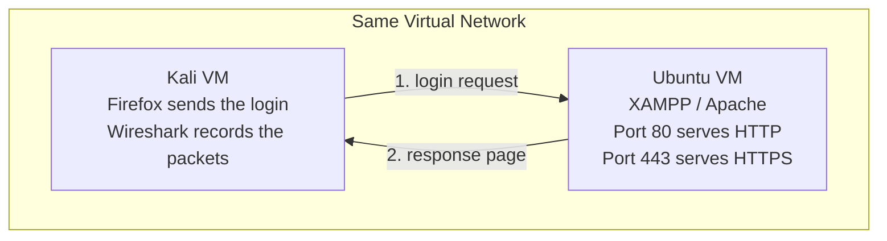
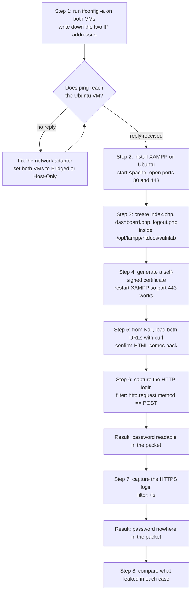
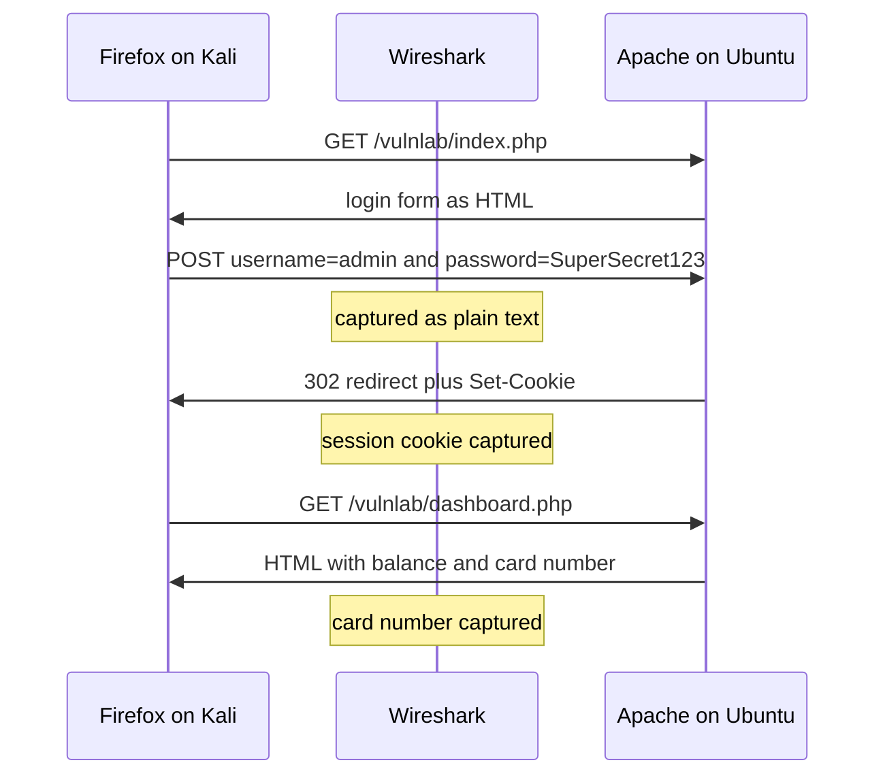
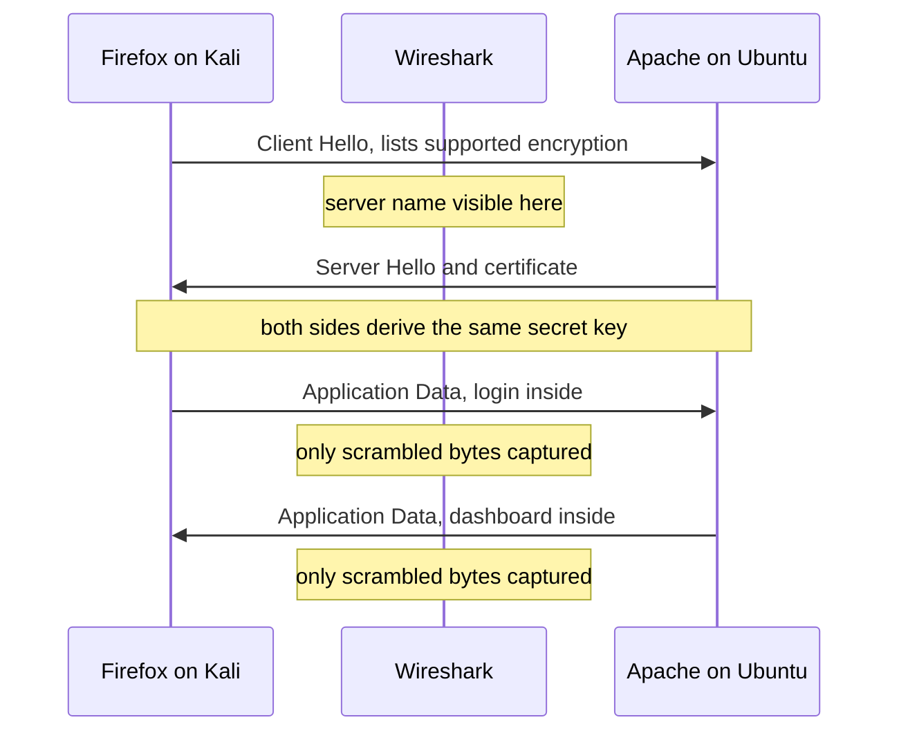
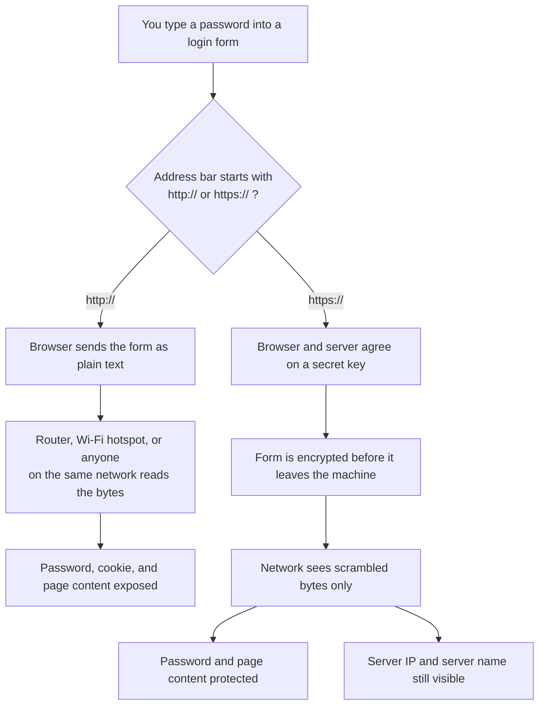

# HTTP vs HTTPS: Catching a Password with Wireshark

Two VMs. Ubuntu runs a login page on XAMPP, Kali opens that page and records the traffic in Wireshark.

Log in over HTTP and you read the password straight out of the packet. Log in over HTTPS and the same login is scrambled bytes.

Takes about an hour. Every command is here, run them in order.

**Checked against, August 2026:** Ubuntu 26.04 LTS "Resolute Raccoon", Kali Linux 2026.2, XAMPP 8.2.12 for Linux, Wireshark 4.6.x. Older versions work the same way.

---

## What you need

- Ubuntu VM (running)
- Kali Linux VM (running)
- The two VMs able to ping each other

Both VMs need the same network mode in your hypervisor. **Bridged Adapter** or **Host-Only Adapter** both work. NAT alone does not, since the VMs end up isolated from each other.

---

## The setup



Ubuntu is the website. Kali is you browsing that website, recording every packet that leaves your own machine.

---

## Roadmap



---

## Step 1: Find the IP addresses

Run this on **both** VMs:

```bash
ifconfig -a
```

Ubuntu 26.04 does not ship it, so install it first:

```bash
sudo apt update && sudo apt install -y net-tools
```

Install that on Ubuntu either way. XAMPP calls `netstat` from the same package when it starts, and without it Step 2 fails with `netstat: command not found`.

This one is already on both VMs and prints the same thing in fewer lines:

```bash
ip -brief addr
```

Look for a line with `inet` and an address like `192.168.1.45` or `192.168.56.101`. Skip `127.0.0.1`, that is the machine talking to itself.

Write both down:

```
Ubuntu IP : 192.168.1.45      <-- replace with yours
Kali IP   : 192.168.1.46      <-- replace with yours
```

Anywhere below that says `<UBUNTU-IP>`, put your real Ubuntu address.

Check they see each other. From Kali:

```bash
ping -c 3 <UBUNTU-IP>
```

Three replies means you are set. No replies means the VMs are on different networks, so fix the adapters first.

---

## Step 2: Install XAMPP on Ubuntu

XAMPP is Apache, PHP, and MySQL in one installer.

Get it from https://www.apachefriends.org/download.html and pick the Linux 64-bit build. The newest Linux one is 8.2.12 from November 2023, with Apache 2.4.58 and PHP 8.2.12. That is the current version, so ignore the 8.5 numbers on the Windows download pages.

```bash
cd ~/Downloads
chmod +x xampp-linux-x64-*-installer.run
sudo ./xampp-linux-x64-*-installer.run
```

Click Next through the wizard, keep the default `/opt/lampp`.

If your VM has no desktop, add a flag and the installer runs in the terminal:

```bash
sudo ./xampp-linux-x64-*-installer.run --mode text
```

Start it:

```bash
sudo /opt/lampp/lampp start
```

You should get `Starting Apache...ok`.

Open the firewall so Kali gets through:

```bash
sudo ufw allow 80/tcp
sudo ufw allow 443/tcp
```

---

## Step 3: Create the login page

Three small files. Paste each block into the Ubuntu terminal as written, `EOF` lines included.

Make the folder:

```bash
sudo mkdir -p /opt/lampp/htdocs/vulnlab
```

**File 1, the login form:**

```bash
sudo tee /opt/lampp/htdocs/vulnlab/index.php > /dev/null <<'EOF'
<?php
session_start();

$users = ['admin' => 'SuperSecret123'];
$error = '';

if ($_SERVER['REQUEST_METHOD'] === 'POST') {
    $username = $_POST['username'] ?? '';
    $password = $_POST['password'] ?? '';

    if (isset($users[$username]) && $users[$username] === $password) {
        $_SESSION['user'] = $username;
        header('Location: dashboard.php');
        exit;
    }

    $error = 'Wrong username or password';
}
?>
<!DOCTYPE html>
<html>
<head><title>VulnLab Login</title></head>
<body style="font-family:sans-serif;max-width:320px;margin:80px auto">
<h2>VulnLab Bank Login</h2>
<?php if ($error !== ''): ?><p style="color:red"><?= htmlspecialchars($error) ?></p><?php endif; ?>
<form method="post">
    <p><input name="username" placeholder="Username" style="width:100%;padding:8px"></p>
    <p><input name="password" type="password" placeholder="Password" style="width:100%;padding:8px"></p>
    <p><button style="width:100%;padding:8px">Sign in</button></p>
</form>
</body>
</html>
EOF
```

**File 2, the page after login:**

```bash
sudo tee /opt/lampp/htdocs/vulnlab/dashboard.php > /dev/null <<'EOF'
<?php
session_start();

if (!isset($_SESSION['user'])) {
    header('Location: index.php');
    exit;
}
?>
<!DOCTYPE html>
<html>
<head><title>VulnLab Dashboard</title></head>
<body style="font-family:sans-serif;max-width:420px;margin:80px auto">
<h2>Welcome, <?= htmlspecialchars($_SESSION['user']) ?></h2>
<p>You arrived over: <b><?= isset($_SERVER['HTTPS']) ? 'HTTPS' : 'HTTP' ?></b></p>
<p>Account balance: <b>Rs 84,250</b></p>
<p>Saved card: <b>4111 1111 1111 1111</b></p>
<p><a href="logout.php">Log out</a></p>
</body>
</html>
EOF
```

**File 3, logout:**

```bash
sudo tee /opt/lampp/htdocs/vulnlab/logout.php > /dev/null <<'EOF'
<?php
session_start();
session_destroy();
header('Location: index.php');
EOF
```

Check it works locally:

```bash
curl -s http://127.0.0.1/vulnlab/ | head -3
```

HTML means the page is up.

Login is `admin` / `SuperSecret123`. The password sits in the file as plain text, which is bad practice and deliberate. The point of the lab is the other problem, that the password crosses the network unprotected.

---

## Step 4: Turn on HTTPS

XAMPP already listens on 443, but its built-in certificate has the wrong name on it. Make a new one matching your Ubuntu IP.

Run this on Ubuntu, swapping in `<UBUNTU-IP>`:

```bash
sudo openssl req -x509 -nodes -newkey rsa:2048 -days 365 \
  -keyout /opt/lampp/etc/ssl.key/server.key \
  -out /opt/lampp/etc/ssl.crt/server.crt \
  -subj "/C=IN/ST=Karnataka/O=VulnLab/CN=vulnlab.local" \
  -addext "subjectAltName=IP:<UBUNTU-IP>,DNS:vulnlab.local"

sudo /opt/lampp/lampp restart
```

The certificate is self-signed, so nobody official vouches for it and the browser will warn you. Clicking through is fine here since you made it yourself a minute ago.

---

## Step 5: Open the site from Kali

```bash
curl -s  http://<UBUNTU-IP>/vulnlab/  | head -3
curl -sk https://<UBUNTU-IP>/vulnlab/ | head -3
```

Both should print HTML. The `-k` tells curl to accept the self-signed certificate.

If both work, the lab is built.

---

## Step 6: Capture the HTTP login

Kali comes with Wireshark, so usually you only have to launch it. Check the version, and install if it is missing:

```bash
wireshark --version
sudo apt update && sudo apt install -y wireshark
```

Anything in the 4.4 or 4.6 series is fine. Current as of August 2026 is 4.6.8, with 4.4.18 on the long-term branch.

Let your user capture without root:

```bash
sudo dpkg-reconfigure wireshark-common
sudo usermod -aG wireshark $USER
newgrp wireshark
wireshark &
```

Answer **Yes** when it asks about non-superuser capture.

Wireshark opens with a list of interfaces. Pick the one holding your Kali IP, usually `eth0` or `eth1`. Check against the `ifconfig -a` output from Step 1 if you are not sure.

Type this into the **capture filter** box above the interface list:

```
host <UBUNTU-IP>
```

Everything unrelated to the lab gets dropped.

Then:

1. Double-click the interface to start capturing.
2. In Firefox on Kali, go to `http://<UBUNTU-IP>/vulnlab/`
3. Log in with `admin` / `SuperSecret123`
4. Once the dashboard loads, hit the red square to stop.

Type this into the **display filter** bar at the top and press Enter:

```
http.request.method == "POST"
```

One packet shows up. Right-click it → **Follow** → **HTTP Stream**.

The window shows the raw conversation. Near the bottom of the request:

```
username=admin&password=SuperSecret123
```

That is the password. Nothing was cracked or guessed, it was sent that way.

Close the window and try one more filter:

```
frame contains "4111"
```

The card number turns up too, because the server sent the whole dashboard back as plain text.

---

### What happened underneath



---

## Step 7: Capture the HTTPS login

Log out first, or the browser reuses the session and skips the form.

1. Start a new capture, same filter.
2. Go to `https://<UBUNTU-IP>/vulnlab/`
3. On the warning page click **Advanced** → **Accept the Risk and Continue**
4. Log in with the same credentials
5. Stop the capture.

Same filter as before:

```
http.request.method == "POST"
```

**Zero packets.**

The browser sent a POST and Apache received one, but Wireshark sees no POST at all. No HTTP text ever existed on the wire. It was encrypted before it left the machine.

Clear that and type:

```
tls
```

The traffic is there, labelled differently. Look at the Info column:

| Packet label | Meaning |
|---|---|
| `Client Hello` | Firefox says hello and lists the encryption it supports |
| `Server Hello` | Apache picks one and starts the encrypted part of the handshake |
| `Application Data` | the actual login, encrypted |

XAMPP 8.2.12 uses TLS 1.3 by default, and TLS 1.3 encrypts the certificate too. Expand the `Client Hello` though and one readable field is still in there, the **Server Name Indication**, which announces the hostname you asked for before encryption starts.

Click any **Application Data** packet and look at the ASCII column on the right of the bytes pane. Scroll it. No `username=`, no `SuperSecret123`, no `4111`. Random bytes.

Search one more time:

```
frame contains "SuperSecret123"
```

Nothing. The password crossed the network and left no readable trace.

---

### What happened underneath



---

## Step 8: Compare

| What someone watching sees | HTTP (port 80) | HTTPS (port 443) |
|---|---|---|
| Your IP and the server IP | visible | visible |
| Which port you connected to | visible | visible |
| Server name you asked for | visible | visible |
| Rough size and timing of the traffic | visible | visible |
| Page you requested (`/vulnlab/`) | visible | hidden |
| **Username** | **visible** | hidden |
| **Password** | **visible** | hidden |
| Session cookie | visible | hidden |
| Card number and balance | visible | hidden |

Two rows are worth a second look.

The IPs show up either way. HTTPS hides what you said, not who you said it to. Someone on the wire still learns which server you visited and roughly how much data you moved.

The server name shows up too. The browser has to say which site it wants before encryption starts, because the server needs that name to pick the right certificate.

That row is changing, though. Encrypted Client Hello hides the server name as well, it became RFC 9849 on 3 March 2026, and Firefox has had it on by default since version 119. It stays off here because the server has to publish a key in a DNS HTTPS record, and a self-signed Apache on a lab VM publishes nothing. Big CDN-hosted sites already hide their SNI from a capture like this. Yours does not.

---

## Decision flow: what protects what



---

## If something goes wrong

**Ping fails between the VMs.** Both need the same adapter type. Set both to Bridged, or both to Host-Only, then restart networking.

**`netstat: command not found` when starting XAMPP.** `net-tools` is missing. Run `sudo apt install -y net-tools` and start XAMPP again.

**Kali gets `403 Forbidden` but Ubuntu localhost works.** Open `/opt/lampp/etc/extra/httpd-xampp.conf`, find `Require local`, change it to `Require all granted`, then `sudo /opt/lampp/lampp restart`.

**Browser shows PHP code instead of a page.** Apache never started. Run `sudo /opt/lampp/lampp status`.

**Wireshark shows no interfaces.** Run `sudo dpkg-reconfigure wireshark-common`, answer Yes, then log out and back in.

**Capture stays empty.** Wrong interface. Pick the one whose IP matches your Kali address from Step 1.

**Login form gets skipped and the dashboard loads.** Old session cookie. Click Log out, or use a private window.

**HTTPS page will not load at all.** Regenerate the certificate and check the IP in `subjectAltName` matches your actual Ubuntu IP.

**`apt update` fails on Kali.** From 2026.2 onward the repository moved out of `/etc/apt/sources.list` into `/etc/apt/sources.list.d/kali.sources`. On a fresh install run `sudo apt update && sudo apt full-upgrade` before anything else.

---

## Shutting down

```bash
sudo /opt/lampp/lampp stop
sudo rm -rf /opt/lampp/htdocs/vulnlab
```

Keep this app on the VM network only. It stores a password in a text file and hands out fake card numbers to whoever logs in. Fine for a lab, nowhere else.

---

## Try next

Same experiment from the terminal, using tcpdump:

```bash
sudo tcpdump -i eth0 -A -s0 'host <UBUNTU-IP> and port 80'
sudo tcpdump -i eth0 -A -s0 'host <UBUNTU-IP> and port 443'
```

Run each one while logging in. The first prints your password. The second prints noise.

Then show that the encrypted version still holds the same data. Close Firefox and relaunch it so it writes its session keys to a file:

```bash
mkdir -p ~/lab
SSLKEYLOGFILE=$HOME/lab/sslkeys.log firefox &
```

In Wireshark go to **Edit → Preferences → Protocols → TLS** and set `(Pre)-Master-Secret log filename` to `/home/kali/lab/sslkeys.log`. Capture the HTTPS login again, then apply `http.request.method == "POST"`. The POST is back, password and all, and a **Decrypted TLS** tab appears in the bytes pane.

That works because you own the client. TLS protects data between two endpoints, so whoever holds an endpoint reads everything.

One more, for the Client Hello. Visit `https://tls-ech.dev` from the same Kali Firefox while capturing, filter on `tls.handshake.type == 1`, and compare that packet with the one from your own server. The public site hides its hostname inside an `encrypted_client_hello` extension. Yours announces it.
